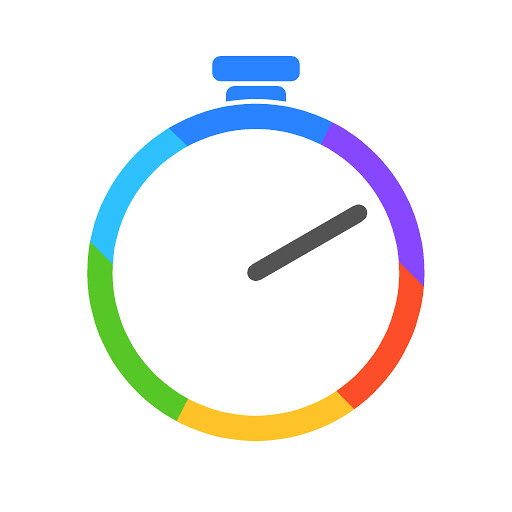

<p align="center" >

</p>

KPerfromanceLogger
==================

**KPerformanceLogger** is a simple, intuitive yet powerful  performance tracking framework for iOS and Mac which furnishs methods to measure and report the time used to execute tasks inside your app.

### Who should use it:
-   You're looking for a way to track down how much time each of you app tasks has been taking.
-   You want to know in which area you need to improve your code/architecture to avoid delays.
-   You’re looking to get a statistics in easily readable format of your app tasks.
-   You want to know whether your tasks pass accepted benchmark time.


### How To Use:


### Initilize KPerformanceLogger in your app
----
1. Import KPerformanceLogger module in your  `UIApplicationDelegate`.
 
    Swift | Objective C
    --- | --- 
    import KPerfromanceLogger | @import KPerformanceLogger

2. Configure  a `KPLoggerConfiguration` shared instance, typically in your application's `application:didFinishLaunchingWithOptions: method:`

    ##### Swift
    ```swift
    KPLoggerConfiguration.useDefaultConfiguration()
    ```
    ##### Obj-C
    ```objc
    [KPLoggerConfiguration useDefaultConfiguration];
    ```
 
 #### Create Transaction id for your feature
----   
1. The first step is to create a transaction id which is used for tracking events of a feature. It is unique for a particular feature and the same id must be passed across all the instances of primitive types like N/W, Coredata, etc which are initiated/created from same feature/class.

    ###### Swift
    ```swift
    //We should pass a unique name while creating each transaction id  as it will be more readable while report will be generated. 
    KPerformanceLoggerManager.getLoggerTransactionIdentifier(of: "FooViewController")
    ```
    
    ##### Obj-C :
    ```objc
    //For Objective c Version we wil be using macros.
    KPLogTransactionID(@"FooViewController")
    ```
2. Classes which are inherited from NSObject will automatically inherit `kpLoggerTransactionId`. Assign newly created transaction id to self in `viewDidLoad`.

    ###### Swift
    ```swift
    override func viewDidLoad() {
        super.viewDidLoad()
        self.kpLoggerTransactionId = KPerformanceLoggerManager.getLoggerTransactionIdentifier(of: "FooViewController")
        }
    ```
    
    ##### Obj-C :
    ```objc
    - (void)viewDidLoad {
    [super viewDidLoad];
    self.kpLoggerTransactionId = KPLogTransactionID(@"FooViewController")
    }
    ```
 ### Pass transaction id across feature
----    
Now consider that there are multiple tasks like n/w calls, parsing, etc for a feature. Obviously each task will be handled by seperate interface, like there will be Network Manager for n/w , Coredata Manager for core data operation and so on.
Question comes since each task has its own class in which each operation is handled, so how do we know which operation belongs to the insatance of which class.
To handle it we need to pass same transaction id that we created for a feature from one instance of a task to another so that across all  tasks, mapping will be managed.

Examlple:
1. When there are single n/w or other tasks.
    #### FooViewController
    ```swift
    class FooViewController: UIViewController {
    var employee: Employee?
    override func viewDidLoad() {
        super.viewDidLoad()
        //Create transaction id and assign it to self
        self.kpLoggerTransactionId = KPerformanceLoggerManager.getLoggerTransactionIdentifier(of: "FooViewController")
        getEmployeeData()
    }
    
    func getEmployeeData() {
        let nw = NetworkManager()
        //Pass same transaction id to instance of NetworkManager.
        nw.kpLoggerTransactionId = self.kpLoggerTransactionId
        nw.getEmployeeData {[weak self] (employee) in
            //Reload Table
            KPerformanceLoggerManager.startUI(transactionId: self?.kpLoggerTransactionId)
            self?.tableViewReload()
            KPerformanceLoggerManager.stopUI(transactionId: self?.kpLoggerTransactionId)
        }
      }
    }
    ```
    #### Network Manager Class
    ```swift
    class NetworkManager: NSObject {
    var responseBlock: DBCompletionBlock?
    func getEmployeeData(completionBlock: @escaping DBCompletionBlock) {
        responseBlock = completionBlock
        //We have transaction id here since we passed it from FooViewController
        //Started tracking n/w request
        KPerformanceLoggerManager.startNetwork(transactionId: self.kpLoggerTransactionId)
        //Webservice calling ....
    }
    
    //Data Receiving Callback
    func dataReceived(responseData:Data) {
        //Stopped tracking n/w request
        KPerformanceLoggerManager.stopNetwork(transactionId: self.kpLoggerTransactionId)
        
        //Parsing....
        KPerformanceLoggerManager.startParsing(transactionId: self.kpLoggerTransactionId, size: nil)
        //Model Creation .....
        ....
        let employeeData = Employee()
        KPerformanceLoggerManager.stopParsing(transactionId: self.kpLoggerTransactionId)
        
        //Callback ..
        responseBlock?(employeeData)
        }
    }
    ```

    ##### Objective C :
    For objective c, you must use Macros defined in KPLogManager.h.
    ```objc
    @implementation FooViewController

    - (void)viewDidLoad {
    [super viewDidLoad];
    self.kpLoggerTransactionId = KPLogTransactionID(@"FooViewController")
    KPLogStartUI(self.kpLoggerTransactionId, @"FooViewController")
    }

    -(void)getEmployeeData {
    NetworkManager * nw = [NetworkManager new];
    nw.kpLoggerTransactionId = self.kpLoggerTransactionId;
    .....
    }

    @end

    ```
2. When there are multiple calls of of primitive type, like there are multiple n/w , coredata, UI rendering tasks under a same feature. For eg. in case of Pagination when on a single fetaure we have multiple calls.
    
    #### FooViewController
    ```swift
    class FooViewController: UIViewController {
    var product: Product?
    override func viewDidLoad() {
        super.viewDidLoad()
        //Create transaction id and assign it to self
        self.kpLoggerTransactionId = KPerformanceLoggerManager.getLoggerTransactionIdentifier(of: "FooViewController")
        getEmployeeData()
    }
    
    func getProductNames() {
        let nw = NetworkManager()
        //Pass same transaction id to instance of NetworkManager.
        nw.kpLoggerTransactionId = self.kpLoggerTransactionId
        nw.getgetProductNames {[weak self] (product) in
            //Reload Table
            KPerformanceLoggerManager.startCascadingUI(transactionId: self?.kpLoggerTransactionId, subType: "getProductNames")
            self?.tableViewReload()
            KPerformanceLoggerManager.stopCascadingUI(transactionId: self?.kpLoggerTransactionId, subType: "getProductNames")
        }
      }
    }
    
    func getProductDetails() {
        let nw = NetworkManager()
        //Pass same transaction id to instance of NetworkManager.
        nw.kpLoggerTransactionId = self.kpLoggerTransactionId
        nw.getProductDetails {[weak self] (product) in
            //Reload Table
            KPerformanceLoggerManager.startCascadingUI(transactionId: self?.kpLoggerTransactionId, subType: "getProductDetails")
            self?.tableViewReload()
            KPerformanceLoggerManager.stopCascadingUI(transactionId: self?.kpLoggerTransactionId, subType: "getProductDetails")
        }
      }
    }
    ```
    #### Network Manager Class
    ```swift
    class NetworkManager: NSObject {
    var responseBlock: DBCompletionBlock?
    func getProductNames(completionBlock: @escaping DBCompletionBlock) {
        responseBlock = completionBlock
        //We have transaction id here since we passed it from FooViewController
        //Started tracking n/w request
        KPerformanceLoggerManager.startNetwork(transactionId: self.kpLoggerTransactionId,           subType: "getProductNames")
        //Webservice calling ....
    }
    
    func getProductDetails(completionBlock: @escaping DBCompletionBlock) {
        responseBlock = completionBlock
        //We have transaction id here since we passed it from FooViewController
        //Started tracking n/w request
        KPerformanceLoggerManager.startNetwork(transactionId: self.kpLoggerTransactionId,           subType: "getProductDetails")
        //Webservice calling ....
    }
    
    //Data Receiving Callback
    func dataReceived(responseData:Data) {
        // To track whether resonse is via Product Names or Product Details
        var subType = respondData.type 
         KPerformanceLoggerManager.stopNetwork(transactionId: self.kpLoggerTransactionId, subType: subType)
         
        //Parsing....
        KPerformanceLoggerManager.startParsing(transactionId: self.kpLoggerTransactionId, subType: subType, size: nil)
        //Model Creation .....
        ....
        let product = Product()
        KPerformanceLoggerManager.stopParsing(transactionId: self.kpLoggerTransactionId, subType: subType)
        
        //Callback ..
        responseBlock?(product)
        }
    }
    ```

 #### Stop Tracking for a feature
----   

1. Call stop tracking method with transaction id.
    ##### Swift :
    ```swift
    KPerformanceLoggerManager.stopTracking(self.kpLoggerTransactionId)
    ```
    ##### Objective C :
    ```objc
    KPLogStopTracking(self.kpLoggerTransactionId)
    ```
2. Alternatively, there is a default timeout of **30 seconds** measured from the recent tracking activity of a feature after which a particular logs will be closed. Timeout can be customized by 'autoCloserTime' property of `KPLoggerConfiguration` class .


### Note:
> If you want manual closer of a feature, you need to explicitly call 'makeLogWaitForCloser:' within 30 seconds of starting any log tracker. 
Consequently log will not be closed automatically, you have to call 'stopTracking:' to close it.

.

> If there are multiple things that you want to track that fall under a primitive type, you must provide same unique subtype string during start and stop method of tracking. For example if there are multiple n/w calls under a feature, you must provide subtype in 'startNetwork:withTransactionID:subType' and consequently stop it with same subtype.


##### API's


  
   Swift | Objective C
    --- | --- 
    startUI(transactionId: subType:) | KPLogStartCascadeUI(transactionId,subTypeName)
    stopUI(transactionId:subType:) | KPLogStopCascadeUI(transactionId,subTypeName)
    startNetwork(transactionId:subType:) | KPLogStartNetwork(transactionId, subTypeName)
    stopNetwork(transactionId:subType:) | KPLogStopNetwork(transactionId,subTypeName)
    startParsing(transactionId:subType:) | KPLogStartParsing(transactionId, subTypeName)
    stopParsing(transactionId:subType:) | KPLogStopParsing(transactionId,subTypeName)
    startCoreData(transactionId:subType:) | KPLogStartCoreData(transactionId, subTypeName)
    stopCoreData(transactionId:subType:) | KPLogStopCoreData(transactionId,subTypeName)
    startCustomAction(transactionId:customType:) | KPLogStartCustomAction(transactionId, customType)
    stopCustomAction(transactionId:customType:) | KPLogStopCustomAction(transactionId,customType)
##### Installation with Carthage (iOS 8+)

[Carthage](https://github.com/Carthage/Carthage) is a lightweight dependency manager for Swift and Objective-C. It leverages CocoaTouch modules and is less invasive than CocoaPods.

To install with Carthage, follow the instruction on [Carthage](https://github.com/Carthage/Carthage)

Cartfile
```
github "KPerfromanceLogger/KPerfromanceLogger"
```

- or [install manually](Documentation/GettingStarted.md#manual-installation)
- read the [Getting started](Documentation/GettingStarted.md) guide, check out the [FAQ](Documentation/FAQ.md) section or the other [docs](Documentation/)
- if you find issues or want to suggest improvements, create an issue or a pull request
- for all kinds of questions involving KPerfromanceLogger, use the [Google group](http://groups.google.com/group/KPerfromanceLogger) or StackOverflow (use [#KPerfromanceLogger](http://stackoverflow.com/questions/tagged/KPerfromanceLogger)).

### Features

#### KPerfromanceLogger is Simple, Fast, Intuitive yet Powerful Tool.

Its a simple framework which is used to track how much time each layer of you app is taking while displaying data to user. We can track each tasks independently or we can have it tracked feature wise. Moreover once all the statistics has been captured, we can export it in any format we want to.

#### Simple
Just with few configuration you can track you app.

#### Flexible:
You can track independent task that you want to or you can group all the tasks that are bound to a particular feature.

#### Statistics:
Once all the tasks has been captured, you can get repsonse in any format. By default CSV format is exported. 

### Requirements 
The current version of KPerfromanceLogger requires:
- Xcode 9 or later
- Swift 3 or later
- iOS 8 or later
- OS X 10.8 or later

### Communication

- If you **need help**, use [Stack Overflow](http://stackoverflow.com/questions/tagged/kPerfromanceLogger). (Tag 'kPerfromanceLogger')
- If you'd like to **ask a general question**, use [Stack Overflow](http://stackoverflow.com/questions/tagged/kPerfromanceLogger).
- If you **found a bug**, open an issue.
- If you **have a feature request**, open an issue.
- If you **want to contribute**, submit a pull request.

### Author
- [Ankit](https://github.com/AnkitNandal)

### Collaborators
- [Kohls](https://github.com/kohls)


### License
- KperfromanceLogger is available under the BSD license. See the [LICENSE file](https://github.com/KperfromanceLogger/KperfromanceLogger/master/LICENSE.txt).

### Architecture

<p align="center" >
    
</p>
